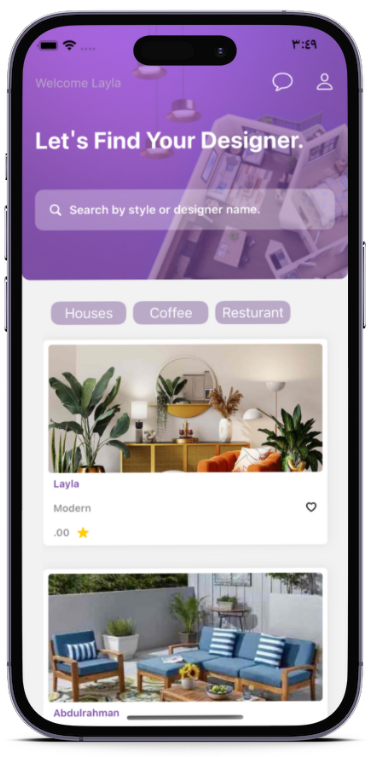
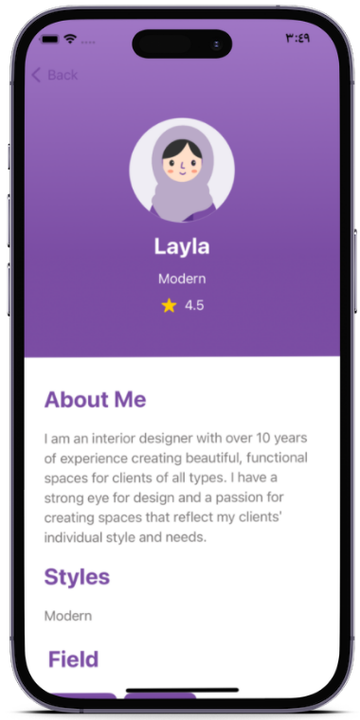
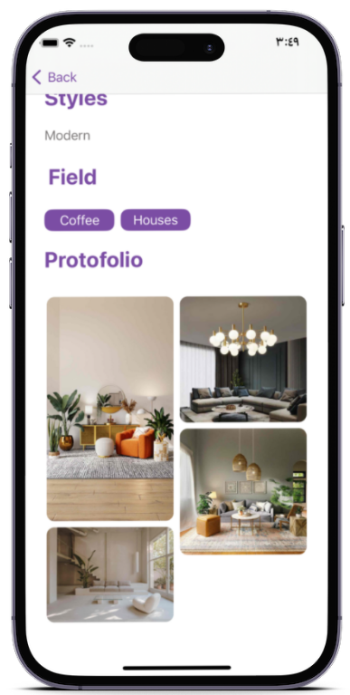
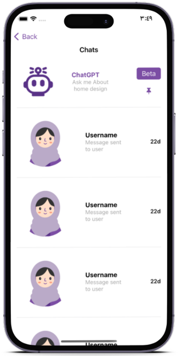
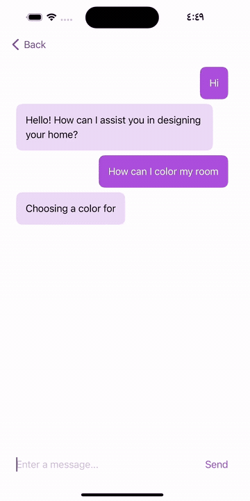

<div align="center">


# Space Genie

**Find Your Interior Designer.**

An iOS app connecting property owners with interior designers in Saudi Arabia — browse portfolios, filter by specialty, message designers directly, with an AI assistant on hand for design questions.

[](https://apps.apple.com/sa/app/space-genie/id6450126107)






</div>

> **Archived.** Space Genie was built and shipped to the App Store in 2023 at the Apple Developer Academy. It is no longer maintained: the Firebase project and API keys were deprovisioned when the program ended, so a fresh clone builds but won't reach a live backend. The App Store listing and the source are kept here as a record of the work.

---

## The problem

Property owners who want to renovate have no straightforward way to find and evaluate interior designers. In user research, respondents split evenly between two pain points: making design and style decisions (50%), and finding the right materials and suppliers (50%).

On the other side, independent designers have nowhere built for a visual, portfolio-driven field. General freelance marketplaces aren't designed for it, and the international platforms that are weren't available in Saudi Arabia.

## The solution

A two-sided marketplace built specifically for interior design. Owners browse portfolios, filter by project type, and start a conversation. Designers build a visual profile and receive enquiries. Both sides can ask an in-app AI assistant about design decisions without waiting on a human reply.

## Features

### Discovery


A feed of designer profiles with cover images, style tags and ratings, filterable by project type — houses, cafés, restaurants — and searchable by name or design style.

Tapping a designer opens a full profile: an about section, styles and fields, a gallery of past work, and a rating surfaced from client feedback.

<br clear="right"/>

### Messaging, with the assistant as the first conversation



Chat threads use Firestore listeners, so messages appear without a manual refresh.

The ChatGPT assistant sits in the same list as human designers — the first conversation, marked Beta. It isn't a separate feature behind its own button; it's another correspondent. The interaction model stays identical whether the reply comes from a person or a model, which meant no second interface to design, build or explain.

<br clear="right"/>

### Asking the assistant



Design questions — trends, colours, styles — get an answer in the same chat interface, streamed in as it arrives.

<br clear="right"/>

## Tech stack

| Layer | Technology | Why |
|---|---|---|
| **UI** | SwiftUI | Declarative state kept three developers in sync with no storyboard merge conflicts |
| **Backend** | Firebase — Auth, Firestore, Storage | Real-time listeners out of the box; messaging shipped in days, with no backend to operate |
| **Auth** | Firebase Auth + Sign in with Apple | Handles the client/designer account split; Apple sign-in is required at review when third-party sign-in is offered |
| **AI** | OpenAI ChatGPT API | The only option in 2023 for usable in-app design Q&A |
| **Design** | SF Pro, custom design system | Shared components defined before feature work began |

## Architecture notes

- **Declarative UI throughout.** Built entirely in SwiftUI — no UIKit view controllers — with state driven by observable view models.
- **Role-based experience.** One app serves two user types; profile, navigation and available actions change depending on whether the signed-in account is a client or a designer.
- **Firebase as the backend.** Auth handles the account split; Firestore stores profiles, portfolios, favourites and chat threads; Storage holds portfolio imagery.
- **Messaging built on an open tutorial.** The chat module is adapted from Brian Voong's *LBTASwiftUIFirebaseChat*, extended with media attachments and the designer profile model. Original file headers are preserved in `FireBaseChat/`.
- **Design system first.** Colours follow a 60/30/10 split, with a shared set of buttons, input fields, icons and avatars defined before feature work — which kept the UI consistent across three developers.

## Scope and outcome

Space Genie shipped to the App Store in October 2023 and was validated with a closed test group. It never onboarded paying clients or designers — all accounts were test accounts, and the commission model below was part of the academy's business track rather than a launched business.

What the project demonstrates technically: a two-sided SwiftUI app with role-based navigation, real-time Firestore messaging, and an integrated LLM assistant, built by three developers in roughly six weeks.

<details>
<summary>Business positioning from the academy submission</summary>

|  | Space Genie | Mostaql | Khamsat | Houzz |
|---|---|---|---|---|
| Available in Saudi Arabia | Yes | Yes | Yes | No |
| Specialized in interior design | Yes | No | No | Yes |
| AI features | Yes | No | No | No |
| Proposed commission | 5% | 20% | 20% | $65/month |

The proposal positioned Space Genie as the only option both available in the Saudi market and purpose-built for interior design, with a Vision 2030 framing around supporting independent designers. None of it was tested against real demand.

</details>

## Timeline

| Date | Milestone |
|---|---|
| May 2023 | Project start |
| June 2023 | Version 1 |
| October 2023 | App Store release, closed testing |
| December 2023 | Version 2 |
| 2024 | Monetization *(planned, never shipped)* |

## Technical challenges

A production crash from an empty portfolio array, the read-versus-write trade-off behind the chat data model, Sign in with Apple's one-time name delivery, and an image pipeline that compressed without resizing:

**[CHALLENGES.md](CHALLENGES.md)**

## Team

Built at the **Apple Developer Academy | TUWAIQ** in Riyadh.

| Name | Role |
|---|---|
| Hajar Alruqi | CEO & Business Manager |
| Wedad Almehmadi | Technology Manager |
| Atheer Alshehri | Design & User Experience Manager |

## Getting started

```bash
git clone https://github.com/we-dad/InteriorDesigner.git
cd InteriorDesigner
open InteriorDesigner.xcodeproj
```

**Requirements**

- Xcode 14 or later, iOS 16.4 or later
- A Firebase project with your own `GoogleService-Info.plist` added to the app target
- Your own OpenAI API key for the assistant

The original Firebase project and API keys are no longer active, so running against a live backend requires supplying your own credentials.

---

<sub>Space Genie is available on the [App Store](https://apps.apple.com/sa/app/space-genie/id6450126107).</sub>
