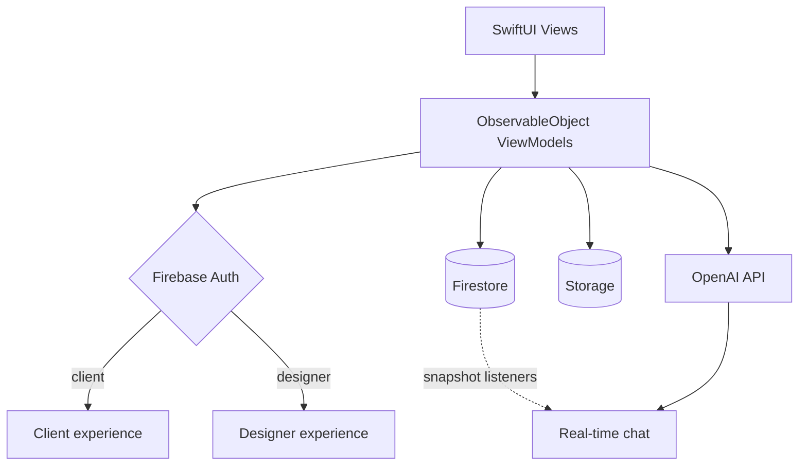

# Space Genie

**Find Your Interior Designer.**

An iOS app that connects property owners with professional interior designers in Saudi Arabia — browse portfolios, filter by specialty, and message designers directly, with an AI assistant on hand for design questions.

[](https://apps.apple.com/sa/app/space-genie/id6450126107)


> **Project status — archived.** Space Genie was built and shipped to the App Store in 2023 as a team project at the Apple Developer Academy. It is no longer actively maintained: the Firebase project and API keys were deprovisioned after the program ended, so a fresh clone will build but won't connect to a live backend. The App Store listing and the source are kept here as a reference for the work.

---

## The problem

Property owners who want to renovate or decorate have no straightforward way to find and evaluate interior designers. In user research, respondents split evenly between two pain points: **making design and style decisions** (50%) and **finding the right materials and suppliers** (50%).

On the other side, interior designers — particularly independent ones — have no dedicated place to showcase work and reach clients. General freelance marketplaces aren't built for a visual, portfolio-driven field, and international platforms aren't available in Saudi Arabia.

## The solution

Space Genie is a two-sided marketplace built specifically for interior design:

- **Property owners** browse designer portfolios, filter by specialty, and start a conversation.
- **Designers** build a visual portfolio, list their styles and fields, and receive client enquiries.
- **Everyone** can ask an in-app AI assistant about design decisions — trends, colors, styles — without waiting on a human reply.

## Features

| Feature | Description |
|---|---|
| **Designer discovery** | Browse a feed of interior designer profiles with cover images, style tags, and ratings |
| **Filter by field** | Narrow results by project type — houses, cafés, restaurants, and more |
| **Search** | Find designers by name or design style |
| **Portfolio builder** | Designers create a profile with an about section, styles, fields, and an image gallery of past work |
| **Direct messaging** | Real-time chat between clients and designers |
| **AI design assistant** | An integrated ChatGPT assistant that answers interior design questions in-app |
| **Favorites** | Save designers to revisit later |
| **Ratings** | Client ratings surfaced on designer cards and profiles |

## Tech stack

| Layer | Technology | Why |
|---|---|---|
| **UI** | SwiftUI | Declarative state kept three developers in sync and avoided storyboard merge conflicts |
| **Language** | Swift | Required by the academy program; native target was iOS only |
| **Backend** | Firebase (Auth, Firestore, Storage) | Real-time listeners out of the box — messaging shipped in days rather than weeks, with no backend to operate |
| **Auth** | Firebase Auth + Sign in with Apple | Apple sign-in is mandatory for App Store review when third-party sign-in is offered |
| **AI** | OpenAI `gpt-3.5-turbo` via Alamofire | The only option in mid-2023 with usable Arabic-language design Q&A |
| **Tooling** | Xcode, Git / GitHub | |

## Architecture notes



- **Declarative UI throughout.** The app is built entirely in SwiftUI — no UIKit view controllers — with state driven by observable view models.
- **Firebase as the backend.** Authentication handles the client/designer account split; Firestore stores user profiles, designer portfolios, favorites, and chat threads; Storage holds portfolio imagery.
- **Real-time messaging.** Chat threads use Firestore listeners so messages appear without a manual refresh.
- **AI assistant as a chat participant.** The ChatGPT integration is surfaced inside the same messaging interface as human designers, so the interaction model stays consistent — the assistant is simply the first conversation in the list.
- **Role-based experience.** A single app serves two user types; the profile, navigation, and available actions change depending on whether the signed-in account is a client or a designer.
- **Messaging built on an open tutorial.** The chat module is adapted from Brian Voong's
  *LBTASwiftUIFirebaseChat*, extended with media attachments and our designer profile
  model. Original file headers are preserved in `FireBaseChat/`. The data model and its
  trade-offs are documented in [docs/CHALLENGES.md](docs/CHALLENGES.md).
- **Design system first.** Colors follow a 60/30/10 split, with a shared component set for buttons, input fields, icons, and avatars defined before feature work began — which kept the UI consistent across three developers.

## Scope and outcome

Space Genie shipped to the App Store in October 2023 and was validated with a closed
test group at the academy. It never onboarded paying clients or designers — all
accounts were test accounts, and the monetization model below was part of the
program's business track rather than a launched business.

What the project demonstrates technically: a two-sided SwiftUI app with role-based
navigation, real-time Firestore messaging, Sign in with Apple, and an integrated LLM
assistant — built by three developers in roughly six weeks.

<details>
<summary>Business positioning from the academy submission</summary>

|  | Space Genie | Mostaql | Khamsat | Houzz |
|---|---|---|---|---|
| Available in Saudi Arabia | Yes | Yes | Yes | No |
| Specialized in interior design | Yes | No | No | Yes |
| AI features | Yes | No | No | No |
| Proposed commission | 5% | 20% | 20% | $65/month |

The proposal positioned Space Genie as the only option both available in the Saudi
market and purpose-built for interior design, with a Vision 2030 framing around
supporting independent designers. None of this was tested against real demand.

</details>

## Timeline

| Date | Milestone |
|---|---|
| May 2023 | Project start |
| June 2023 | Version 1 |
| October 2023 | App Store release, closed testing |
| December 2023 | Version 2 |
| 2024 | Monetization *(planned, never shipped)* |

## Technical challenges

The interesting engineering problems — a production crash from an empty portfolio
array, the read-vs-write trade-off behind the chat data model, Sign in with Apple's
one-time name delivery, and the image pipeline's compression-without-resizing bug —
are documented in **[docs/CHALLENGES.md](docs/CHALLENGES.md)**.

## Roadmap

- **AI decoration generator** — generate room design concepts from a photo or a text description
- **Multi-language support** — Arabic and English

## Team

Built at the **Apple Developer Academy | TUWAIQ** in Riyadh.

| Name | Role |
|---|---|
| Hajar Alruqi | CEO & Business Manager |
| Wedad Almehmadi | Technology Manager |
| Atheer Alshehri | Design & User Experience Manager |

## My contribution

Technology Manager and iOS developer. I owned the authentication and profile layer:
Sign in with Apple and Firebase Auth, the dual-path signup flow for clients and
designers, the designer profile editor, photo selection and upload to Firebase Storage
with deletion, and the styles-and-fields taxonomy. See commits authored by `wee`.

## Getting started

```bash
git clone https://github.com/we-dad/InteriorDesigner.git
cd InteriorDesigner
open InteriorDesigner.xcodeproj
```

**Requirements**

- Xcode 14 or later
- iOS 16.4 or later
- A Firebase project with your own `GoogleService-Info.plist` added to the app target
- Your own OpenAI API key for the assistant feature

The original Firebase project and API keys are no longer active, so running the app against a live backend requires supplying your own credentials.

---

<sub>Space Genie is available on the [App Store](https://apps.apple.com/sa/app/space-genie/id6450126107).</sub>
